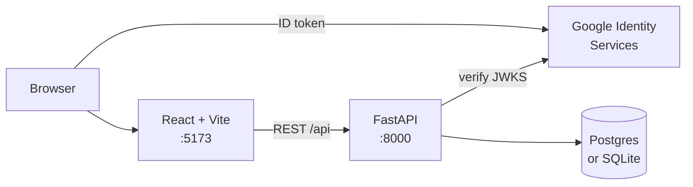
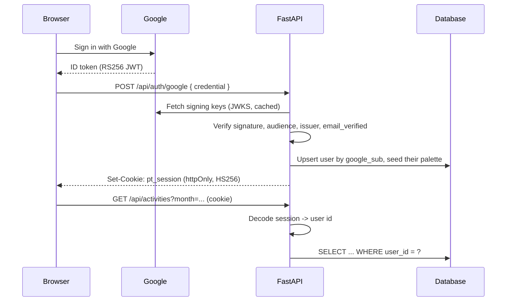
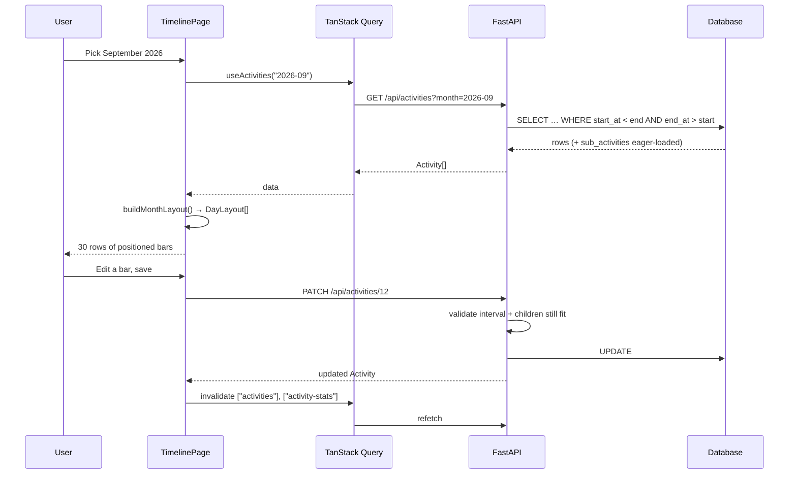
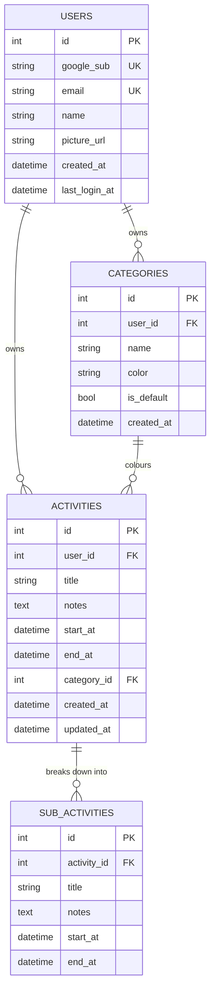
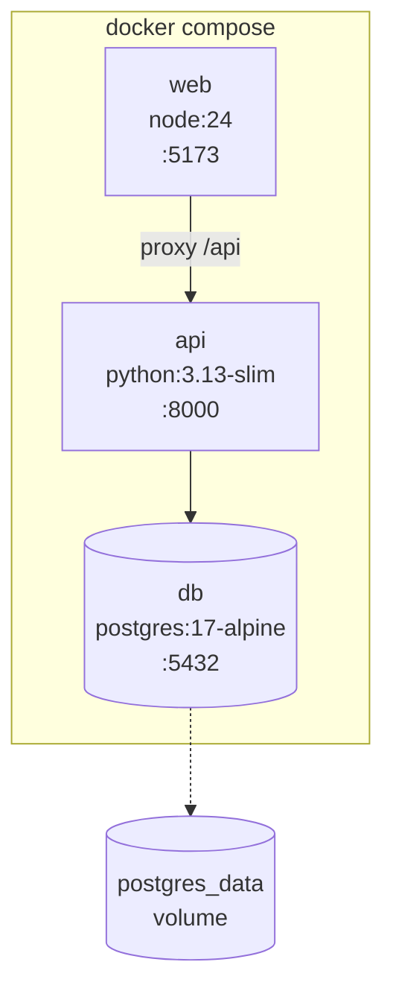
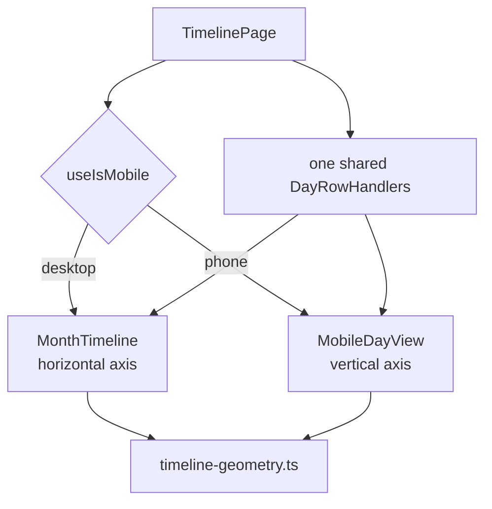

# Architecture

## System Overview



Two services, one database, and Google as the identity provider. Every API
route except `/health` and `/api/auth/*` requires a session and is scoped to
the signed-in account.

## Routing and Pages

| Route      | Access                     | Purpose                                     |
| ---------- | -------------------------- | ------------------------------------------- |
| `/`        | Public                     | Landing page; describes the app and hosts sign-in |
| `/tracker` | Requires a session         | The timeline itself                         |
| `*`        | Public                     | Falls back to the landing page              |

`RequireSession` guards `/tracker`, but it is a convenience rather than the
security boundary: the API independently rejects every unauthenticated request,
so forcing the route yields an empty, non-functional page and never another
account's data.

## Authentication

Two distinct tokens are involved and must not be conflated:

1. **Google's ID token** — a short-lived RS256 JWT the browser obtains from
   Google Identity Services. The backend verifies its signature against
   Google's published keys (`google-auth` handles JWKS fetching and caching),
   checks the audience and issuer, and requires `email_verified`. It is then
   discarded; it is never stored.
2. **This API's session token** — an HS256 JWT signed with `SESSION_SECRET`,
   carrying only the local user id. Delivered in an httpOnly, `SameSite=Lax`
   cookie so page scripts cannot read it.



The OAuth **client secret** plays no part in this flow and is not configured
anywhere. The **client ID** is public by design and is returned by
`/api/auth/session` so the browser needs no environment variable of its own.

### The development bypass

`AUTH_DEV_BYPASS=1` makes the API treat any request without a cookie as a fixed
local account. It exists so the app is usable before Google credentials are set
up, and it is deliberately visible: the account menu renders a banner whenever
it is active, and the API logs a warning at start-up. A valid session cookie
always takes precedence over the bypass, so signing in properly still works on a
machine that has it enabled. It must be `0` in any deployment.

### Per-account isolation

Ownership is enforced *in the lookup*, not by a check after the fetch:

```python
select(Activity).where(Activity.id == activity_id, Activity.user_id == user_id)
```

A miss raises the same `404` as a genuinely absent row. Returning `403` for
another account's id would confirm that the id exists, which is an enumeration
oracle. Sub-activities are reached through a join on their parent's owner, so
they inherit the same rule. Categories are per-account too: `(user_id, name)`
is unique rather than `name`, and a fresh account is seeded with its own copy
of the default palette on first sign-in.

## The Core Problem: Time to Pixels

Everything visual derives from a single scalar, `pxPerMinute`, defined in
[`frontend/src/lib/timeline-geometry.ts`](frontend/src/lib/timeline-geometry.ts):

| Constant          | Value                | Meaning                        |
| ----------------- | -------------------- | ------------------------------ |
| `MINUTES_PER_DAY` | 1440                 | The axis domain                |
| `SLOT_MINUTES`    | 2                    | 30 slots per hour, 720 per day |
| `hourWidth`       | 120 / 240 / 480 px   | Zoom levels                    |
| `pxPerMinute`     | `hourWidth / 60`     | Derived, not configured        |

A bar's box is computed from the *end* minute, not from a rounded width:

```ts
left  = startMinute * pxPerMinute
right = endMinute   * pxPerMinute
width = max(right - left, MIN_BAR_WIDTH)
```

This matters. Computing `width = duration * pxPerMinute` and rounding
independently lets adjacent bars drift apart by a pixel at some zoom levels;
deriving both edges from the same mapping keeps them flush. At the default zoom
(240 px/hour → 4 px/minute) an activity at 03:53 lands at `left: 932px`
(233 × 4) and a 48-minute duration is exactly `192px`.

### Why absolute positioning, not CSS grid

The reference implementation this project was modelled on placed day-resolution
bars with `grid-column: start / end`. That cannot work here: grid columns snap to
integer boundaries, so a 03:53 start would be forced onto a 2-minute slot edge.
Absolute positioning within a `position: relative` lane gives arbitrary minute
precision at no extra cost.

### Why the grid is painted, not built

720 slot boundaries per row × 31 rows would be roughly 22,000 DOM nodes for one
month. Instead `laneBackgroundImage()` stacks four `repeating-linear-gradient`
layers — 2-minute, 10-minute, hourly, and alternating hour bands — which costs
zero nodes and scales with zoom automatically. The 2-minute layer is suppressed
below a 4px pitch, where it would read as a grey smear rather than a scale.

## Sticky Scrolling

A single element owns both scroll axes. Inside it:

| Element                 | Position                       | z-index |
| ----------------------- | ------------------------------ | ------- |
| Hour header row         | `sticky top-0`                 | 30      |
| Header's corner cell    | `sticky top-0 left-0`          | 40      |
| Each row's day panel    | `sticky left-0`                | 20      |
| Activity bars           | `absolute` within the lane     | auto    |

One shared scroller is what keeps the hour ruler and all 31 rows in exact
horizontal alignment. Two synchronised scroll containers drift under fast
scrolling and fight each other on momentum scroll.

## Frontend Architecture

```
frontend/src/
├── api/            typed fetch layer (client, endpoints, per-resource modules)
├── hooks/          TanStack Query hooks; no component fetches directly
├── lib/
│   ├── timeline-geometry.ts   time → pixels (pure)
│   ├── timeline-layout.ts     day splitting + lane packing (pure)
│   ├── date-utils.ts          local wall-clock helpers (pure)
│   └── utils.ts               cn(), colour contrast
├── components/
│   ├── timeline/   month-timeline (scroll shell), timeline-header, day-row,
│   │               activity-bar, sub-activity-bar, month-picker, toolbar, summary
│   ├── activity/   form dialog, delete confirmation
│   ├── auth/       google-sign-in-button, account-menu
│   ├── landing/    hero-timeline (renders with the live geometry)
│   └── ui/         button, dialog, select, popover, field, spinner, error display
├── routes/         router, require-session guard
├── pages/          landing-page, timeline-page (state orchestration)
└── types/api.ts    explicit request/response contracts
```

The layout pipeline is deliberately pure and separated from rendering:

```
Activity[] (flat, absolute timestamps)
   │  splitByDay()      → clip at midnight, flag cut edges
   │  assignLanes()     → greedy interval colouring
   ▼
DayLayout[] (per-day, lane-packed segments)
   │  intervalToBox()   → left / width in pixels
   ▼
rendered bars
```

### Overnight activities

An activity from 23:10 to 01:30 is one record. `splitByDay` emits two segments:
`{ day 18, 23:10–24:00, continuesAfter }` and
`{ day 19, 00:00–01:34, continuesBefore }`. The clipped edge is drawn square
with a light continuation border, so the bar does not falsely appear to end at
midnight. Daily minute totals use the same split, so an overnight block is
attributed to both days correctly.

### Overlapping activities

Overlaps are allowed rather than rejected — you should never be blocked from
recording what actually happened. `assignLanes` performs greedy interval-graph
colouring: each segment goes in the first lane whose previous occupant has
finished. Row height is then `laneCount × LANE_HEIGHT + gaps`, so rows grow only
as much as they need.

Sub-lanes are stacked beneath *all* parent lanes, not beneath their own parent.
Nesting them under a single lane would let a deep sub-bar stack collide with a
parent bar sitting in a lower lane.

## Backend Architecture

```
backend/app/
├── main.py                 app factory, CORS, error handlers, lifespan
├── core/
│   ├── config.py           pydantic-settings; SQLite default
│   ├── db.py               engine, session factory, declarative base
│   ├── security.py         Google ID-token verification, session JWTs
│   └── deps.py             request-scoped settings and current account
├── models/                 User, Category, Activity, SubActivity
├── schemas/                Pydantic request/response contracts
├── services/
│   ├── activity_service.py interval and containment rules
│   ├── stats_service.py    monthly aggregation
│   ├── time_range.py       month windows, per-day minute splitting
│   ├── user_service.py     account upsert and per-account seeding
│   ├── seed.py             default category palette (per account)
│   └── errors.py           ApiError hierarchy → HTTP status
└── routers/                thin HTTP adapters
```

Routers translate HTTP to a service call and nothing more. All rules live in
services, which makes them testable without a client and impossible to bypass
by adding a new endpoint.

## Data Flow



The month query uses *overlap*, not containment
(`start_at < window_end AND end_at > window_start`), so an activity beginning on
the last night of the previous month still appears on day 1. Indexes:
`activities(start_at, end_at)` and `sub_activities(activity_id)`.

## Database Schema



- `sub_activities.activity_id` is `ON DELETE CASCADE`: deleting an activity
  removes its breakdown. SQLite needs `PRAGMA foreign_keys=ON` per connection
  for this to take effect, which `core/db.py` registers on connect.
- `activities.category_id` is `ON DELETE SET NULL`: deleting a category leaves
  its activities intact but uncategorised, rather than destroying time records.
- `activities.user_id` and `categories.user_id` are `ON DELETE CASCADE`:
  removing an account removes its data. Both are nullable so rows created
  before accounts existed survive rather than being destroyed; they are
  invisible to every route (which all scope to a concrete user) until
  `scripts/claim_legacy_activities.py` assigns them an owner.
- `categories` is unique on `(user_id, name)`, not on `name`.

### Migrating an existing database

`create_all` creates missing tables but never alters existing ones, so adding
accounts needed `scripts/migrate_add_accounts.py`. Two details there are worth
remembering:

1. **Foreign keys must be disabled for the table rebuild.** SQLite cannot drop
   a constraint in place, so `categories` is rebuilt and renamed. With
   `PRAGMA foreign_keys=ON`, `DROP TABLE` performs an implicit row-by-row
   delete, which fires `activities.category_id`'s `ON DELETE SET NULL` and
   silently discards every activity's category. The script turns enforcement
   off around the rebuild and runs `PRAGMA foreign_key_check` afterwards.
2. **A rebuilt table must restate its defaults.** The first version of the
   rebuild dropped `created_at`'s `DEFAULT (CURRENT_TIMESTAMP)`, which made
   every later insert fail its `NOT NULL` constraint.

This is precisely the cost that a migration tool such as Alembic exists to
absorb, and it is the change that would justify adopting one.

## Time Handling

**Timestamps are stored as `TIMESTAMP WITHOUT TIME ZONE` holding local
wall-clock time.** This is a deliberate decision, not an oversight.

The timeline addresses time by minutes-from-midnight. If timestamps were stored
in UTC and converted for display, a 03:53 entry would land in a different hour
column — and potentially a different day row — depending on the viewer's offset,
and would shift across a DST boundary. For a personal tracker, "03:53" means
03:53 on the clock on the wall; that is the value worth preserving.

Consequences, accepted:

- The data is not portable across timezones without a migration. A user who
  relocates keeps their historical entries at the original wall-clock times,
  which is almost always what they want for a record of their own past.
- Multi-user or multi-timezone support would require storing a timezone
  alongside each activity and converting at the edges. That is the change to
  make if this ever stops being a single-user tool.

Seconds and microseconds are truncated on input (`normalize_timestamp`), so the
stored value matches what the timeline can express and the geometry never has to
render a fraction of a minute.

## Validation

Every rule is enforced server-side; the client duplicates the cheap ones purely
for instant feedback.

| Rule                                                     | Status |
| -------------------------------------------------------- | ------ |
| `end_at > start_at`                                      | 422    |
| Duration ≤ 24 hours                                      | 422    |
| `title` 1–200 chars, `notes` ≤ 2000                      | 422    |
| `color` matches `^#[0-9a-fA-F]{6}$`                      | 422    |
| `month` matches `^\d{4}-(0[1-9]\|1[0-2])$`               | 422    |
| Sub-activity lies fully within its parent's window       | 422    |
| Parent resize would orphan existing sub-activities       | 422    |
| Unknown `category_id` / activity id / sub-activity id    | 404    |
| Duplicate category name                                  | 409    |
| Deleting a built-in category                             | 422    |
| No session, or an expired/tampered session cookie        | 401    |
| An id belonging to another account                       | 404    |
| A Google ID token that fails verification                | 401    |
| A Google account whose email is not verified             | 401    |

The orphan rule is worth calling out: shrinking an activity past an existing
sub-activity is **refused** rather than silently clamping or deleting the child,
and the error names the offending sub-activities. Losing data the user typed is
worse than making them do one extra step.

## AI Integration

None. The project brief for this repository mandates Hugging Face with an access
token *if* AI features exist; this application has no AI feature, so no
Hugging Face dependency, token or client code is present. Were one added (for
example a natural-language summary of the week), the token would live only in
backend environment configuration and all inference calls would be proxied
through the API — never exposed to the browser.

## Docker / Service Architecture



`api` waits on a Postgres healthcheck (`service_healthy`) rather than mere
container start, because start-up creates tables and would fail against a
Postgres that is up but not yet accepting connections.

## Important Architectural Decisions

| Decision                                    | Rationale                                                                                               |
| ------------------------------------------- | ------------------------------------------------------------------------------------------------------- |
| Absolute positioning over CSS grid for bars | Grid columns snap to integers; minute-exact starts require sub-column placement                         |
| One scalar (`pxPerMinute`) for all geometry | Zoom cannot desynchronise the header, grid lines and bars if they all derive from the same number       |
| Grid lines as CSS gradients                 | ~22,000 DOM nodes per month avoided                                                                     |
| Naive local timestamps                      | Preserves wall-clock meaning; UTC round-trips would move bars between columns and rows                  |
| Overlaps allowed and lane-packed            | The tool must be able to record what actually happened                                                  |
| Parent shrink refused, not auto-clamped     | Never silently discard user-entered detail                                                              |
| `create_all` instead of a migration tool    | The schema is owned by this service alone and evolves additively; Alembic is the next step if that changes |
| SQLite default, Postgres-compatible ORM     | Runs with zero external services locally while staying deployable on Postgres unchanged                 |
| No virtualisation of rows                   | A month is at most 31 rows; a virtualiser would add remeasurement complexity for no benefit             |

## Design System

One committed direction: **Warm Workspace**. The feeling to leave is a
well-made paper planner. Tokens live in `frontend/src/index.css`.

| Move | Decision |
| --- | --- |
| Type | Petrona (soft serif) for display, Hanken Grotesk for body and numerals. Self-hosted via `@fontsource`, so there is no runtime font dependency. |
| Colour | Sand ground, warm ink, clay as the one interactive accent. Red is functional only (now-line, destructive). Clay is never a category colour. |
| Surfaces | Rounded 12-22px cards on two-layer soft shadows (`--lift-1/2/3`). Depth carries hierarchy; borders are secondary. |
| Texture | A fixed, faint paper grain on `body::before`, multiply-blended in light mode and screen-blended in dark. |
| Motion | One easing (`--ease-settle`). `settle` for surfaces, `grow-x` / `grow-y` for bars. Nothing animates on scroll. |

Four utility classes carry the type system: `.display`, `.display-italic`,
`.readout` (tabular figures) and `.label-soft`. Tabular figures are a
*functional* choice, not a stylistic one: they keep a column of times aligned
even though Hanken Grotesk is not monospaced.

Category colours are seeded per account in `backend/app/services/seed.py` as a
muted family at similar saturation and value. Six saturated hues would turn a
month into a rainbow and leave the interface with no dominant colour.

The landing hero renders through `intervalToBox`, the same function the live
timeline uses, so the marketing visual cannot drift from what the product
actually draws.

## Responsive Architecture



The two views are genuinely different compositions, not one layout with
different padding:

| | Month grid (>= md) | Day view (< md) |
| --- | --- | --- |
| Time axis | horizontal, 24 columns | vertical, 24 bands |
| Day axis | vertical, one row each | a swiping pager, one day per page |
| Sub-activities | lanes beneath the parent | chips nested *inside* the parent |
| Scale | 120 / 240 / 480 px per hour | fixed 92px per hour |
| Add | toolbar button | floating action button |

Both derive from `timeline-geometry.ts`. The vertical helpers
(`buildVerticalGeometry`, `intervalToVerticalBox`,
`verticalPxToSnappedMinutes`) are the same mapping applied to the other axis,
so minute precision is identical in both.

`DayRowHandlers` is defined once in `TimelinePage` and passed to whichever view
is mounted, so create / edit / delete / expand behave identically and cannot
drift apart.

### Three details worth keeping

**Per-cluster widths.** The mobile view divides the column horizontally among
concurrent activities, so it cannot use the day's `laneCount`: one overlapping
pair in the afternoon would squeeze the morning's single activity to half width.
`assignClusterSizes` in `timeline-layout.ts` tags each segment with the lane
count of *its own* overlap cluster. The month grid stacks lanes vertically and
does not need this.

**A tall block's title sticks.** A three-hour block is taller than the
viewport, so its header is `position: sticky` within the block: scrolling
through it leaves the title on screen instead of a bare slab of colour.

**No `requestAnimationFrame` for layout effects.** rAF does not fire at all
while a document is hidden (a background tab, or a headless preview pane), so
an effect that defers measurement into rAF silently never runs there. The
day-strip centring calls `scrollIntoView` synchronously from the effect
instead; effects already run after the DOM is committed, and `scrollIntoView`
forces the layout it needs.

## Maintaining This Document

Update this file whenever the geometry constants, the sticky-scroll structure,
the mobile/desktop split, the time-handling decision, the ownership/isolation
rules or the database schema changes. Those six are what a future reader needs
to understand before changing anything safely.
